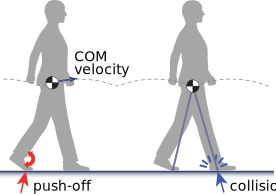
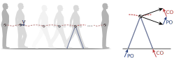

Simple Locomotion Model
================

  Notebooks
and code for optimization of a pendulum-like model of locomotion.
Dynamical model performs walking tasks specified by optimal control.
Human experiments to test model are described in publications.

## Optimization of energy and time predict dynamic walking speeds

## Humans plan for the near future to negotiate uneven terrain

## About the model

The “simplest walking model” (Kuo, 2002) models the legs as simple
pendulums. There is a point mass for the body, and infinitesimal point
masses for the feet. For the present publications, walking speed varies
by relatively small amounts, for which modulation of the swing leg is
treated as having low cost. For increasing speeds and step frequencies,
the swing leg cost increases sharply (Kuo, 2001).

The optimization is performed withj the [Julia
language](https://julialang.org), a fully open-source language. It uses
open-source packages for optimization ([JuMP](https://jump.dev/), the
model dynamics [DynLoco](https://github.com/kuo-lab/DynLoco). The
emphasis here is on simplicity and code readability. The Julia code
provides a minimal demonstration of the mechanics and optimization
approach. The entire tool chain is open source.

Users are invited to view the notebooks and source code in this
repository. Motivated individuals may also wish to execute and modify
the code themselves, which necessitates installation of Julia.

## Code installation

- Install Julia according to the [Getting Started
  guide](https://docs.julialang.org/en/v1/manual/getting-started/)
- The Jupyter notebooks also require installation of
  [Jupyter](https://jupyter.org/). Assuming a
  [Python](https://www.python.org/) installation, Jupyter may be
  installed with [`pip`](https://jupyter.org/install) or
  [`conda`](https://anaconda.org/main/jupyter).
- Run Julia from the `simplelocomotionmodel` directory
- Install packages using package manager, from the Julia prompt:
  - `Using Pkg`
  - `Pkg.activate()` activates an environment with relevant packages
  - `Pkg.instantiate()` downloads and installs packages (can take
    several minutes)
- The Jupyter notebooks have file extension `ipynb` and can be opened
  and executed with a variety of viewers. A recommended workflow uses
  the [VS Code](https://code.visualstudio.com/) editing environment,
  which can open, execute, and render Jupyter notebooks.

### Dependencies

The model equations are implemented in the
[DynLoco](https://github.com/kuo-lab/DynLoco) package with Julia. This
package is automatically installed with the present repository’s
environment (see `instantiate` above). All other dependencies are within
the Julia packages and managed with the environment. No additional
management steps are necessary. \### References \### Issues and pull
requests Please file an
[issue](https://github.com/kuo-lab/simplelocomotionmodel/issues) for
bugs or problems. Pull requests are welcomed.
